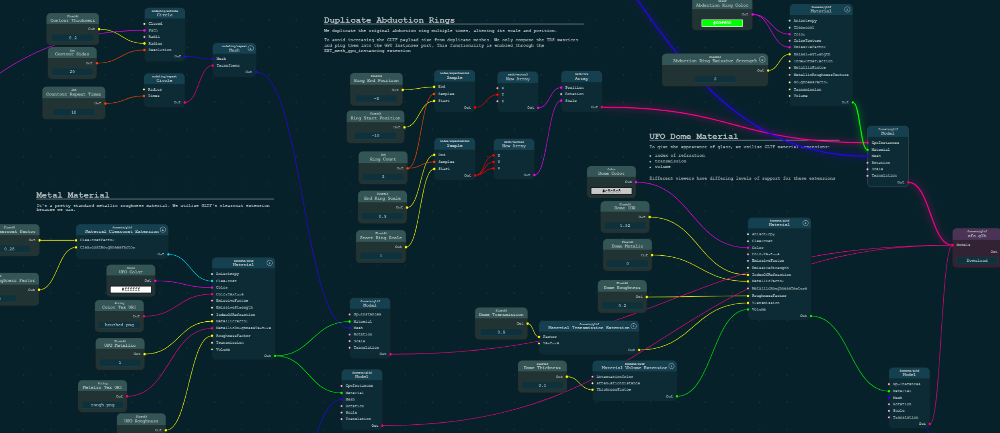

# Node Flow

Another Flow-based Node graph Library.

Check it out [here](https://elicdavis.github.io/node-flow/).



## About

Node Flow is a javascript library that enables developers to build node based tools similar to Unreal Blueprints or Blender Nodes. 

## Features

* Nodes
* Markdown Notes
* More Nodes

## Install

Download the latest build [here](https://raw.githubusercontent.com/EliCDavis/node-flow/gh-pages/dist/web/NodeFlow.js).

## Building

If you want to build the library yourself, you can run

```bash
npm run package
```

## API

### Graph API

#### Creation

The only requirement for creating a graph is providing it an instance of a [canvas](https://developer.mozilla.org/en-US/docs/Web/HTML/Element/canvas).

```javascript
// Create a canvas to render our graph to
var canvas = document.createElement("canvas");

// Create our Node Flow Graph
var graph = new NodeFlowGraph(canvas)
```

There are a bunch of optional parameters you can provide the graph:

```javascript
var graph = new NodeFlowGraph(canvas, {
    // Background color of the graph.
    backgroundColor: "#FF5500",

    // You can add extra items to the context
    // menu that pops up when you right click.
    contextMenu: {
        subMenus: [
            {
                // Text that shows up in the context
                // menu 
                name: "Example Context Menu Item",
                
                // This is recursive. We can nest as 
                // many submenus within eachother as
                // we want. This field is optional.
                subMenus: [],

                items: [
                    {
                        name: "Sub menu Item!!!"
                    }
                ]
            }
        ],

        // Items that show up at the base of the 
        // context menu
        items: [
            {
                // Text that shows up in the context
                // menu 
                name: "Example Context Menu Item",
                
                // Function that get's executed when
                // Item is clicked.
                callback: () => {
                    alert("Example Context Menu Item");
                }    
            }
        ]
    },

    // Notes we want rendered on the graph.
    board: {
        notes: [
            {
                // Where to render the note
                position: { x: 20, y: 20 },

                // Whether or not the note can be 
                // interacted with on the graph
                locked: true,

                // Markdown enabled text
                text: `
                # My First note!!!

                Not sure what to write here
                `
            },  
        ]
    },
});
```

### Node API

#### Creation

```javascript
// All nodes require a title. That's about it.
var node = new FlowNode({ 
    title: "My First Node!",
});

// Be sure to add it to the graph so it can be rendered.
graph.addNode(node);
```

#### Inputs and Outputs

Create a Add node that takes two numbers and outputs a single number

```javascript
var node = new FlowNode({ 
    title: "Add",
    inputs: [
        { name: "a", type: "float32" },
        { name: "b", type: "float32" }
    ],
     outputs: [
        { name: "sum", type: "float32" }
    ],
});
```

You can also add additional inputs and outputs to the node after it's been created

```javascript
node.addInput({ name: "c", type: "float32" })
node.addOutput({ name: "sum", type: "float32" })
```

## Library Development

Just run

```bash
```npm run watch
